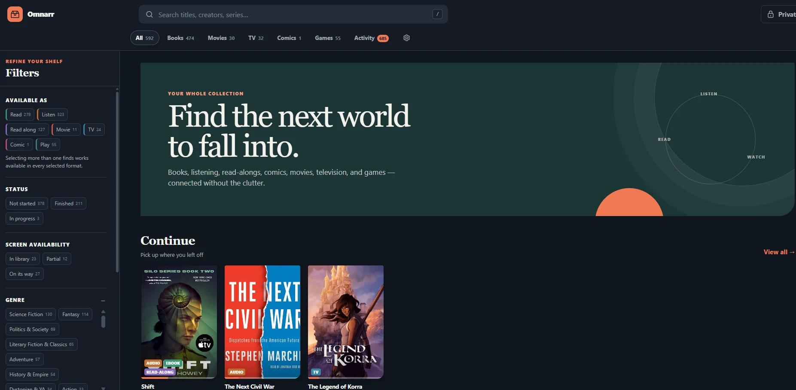
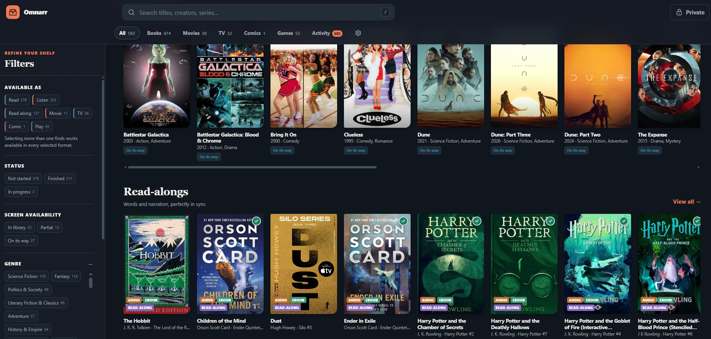
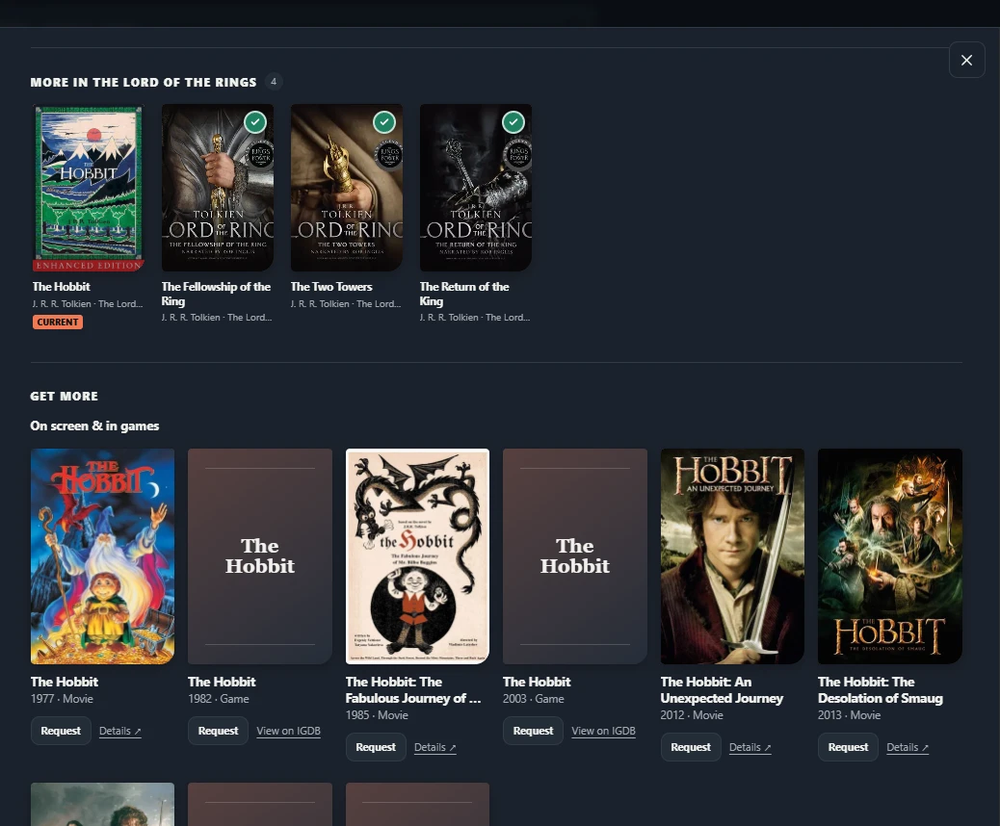
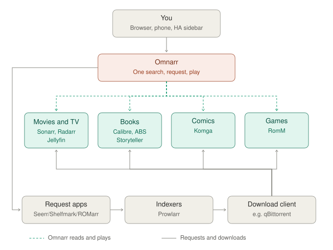
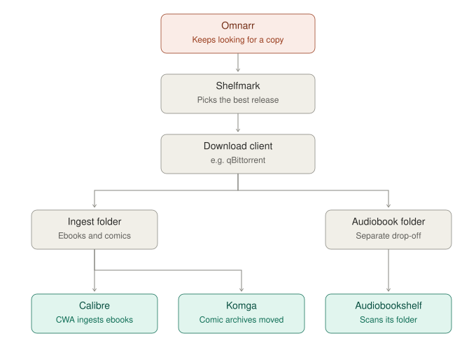

# Omnarr

**One place to search, browse, request and play everything on your media server.**

Omnarr sits in front of the self-hosted apps you already run (Calibre, Audiobookshelf,
Storyteller, Jellyfin, Sonarr, Radarr, Komga, RomM and others). It builds one search
index across all of them, groups the copies of a work together, and lets you act on
anything from one screen. Your apps stay in charge of storage, downloads and metadata.
Omnarr is the front end.



> Status: 1.0. It runs every day on a home server shared with family and friends. Please
> file issues.

## What it does



- **One search across every app**, with facets (kind, format, genre, year, "have it" or "missing").
- **Works, not files.** The ebook (Calibre), audiobook (Audiobookshelf) and read-along
  (Storyteller) of one book appear as **one Book**. Screen adaptations show as separate,
  linked entries. Series and shared universes are shown in reading order.

  

- **Live details** from the owning app: which episodes you have or are missing, download
  progress, listening and reading positions.
- **Everything related, in one place.** A show, movie, book or comic page lists the rest of
  its world from Wikidata: the same franchise, adaptations, and what it was based on.
  Open *Avatar: The Last Airbender* and you get Korra, the films, the live-action series,
  the novels, the comics and the games.
- **Request from anything:** missing episodes and movies (Seerr → Sonarr/Radarr), books,
  audiobooks and comics (Shelfmark, or ReadMeABook for audiobooks), and games (ROMarr). That
  includes anything in a related list, and any title you search for that isn't in the library.
- **Keep looking.** Wanted books are re-searched on a schedule until an acceptable copy turns up.
  "Search harder" runs a free-text Prowlarr search and pushes the release to Sonarr or Radarr.
- **Play and read in the browser.** Video plays from Jellyfin (direct or transcoded HLS), and
  audiobooks from Audiobookshelf with chapters. Comics from Komga open in a page-by-page reader
  with spreads and right-to-left, and Calibre EPUBs open in an ebook reader. Everyone's place is
  saved, and it's written back to the owning app where that app supports it.
  App credentials never reach the browser.
- **Share it.** Give family and friends their own accounts with exactly the permissions you
  choose: request things, save files to their own device, upload, and the private section.
  Invite them with a link you text or email. Everyone's progress is their own.
- **Save and upload.** Download the original ebook, read-along, audiobook, comic, movie or
  game. People you allow can upload their own books and audiobooks to drop-off folders you choose.
- **An optional private section** (Stash, adult Jellyfin libraries, 18+ Komga series, Calibre
  books tagged NSFW), off by default and PIN-locked, with a PIN per person.
- **Read-only by design.** Omnarr never writes to another app's files. Changes go through
  each app's own API, and every change is logged on the Activity page. The only exception
  is the upload folders, and only if you set them.

## How it fits in

Omnarr is the front end. Your existing apps keep storing, downloading and organising, and
Omnarr reads from them, plays through them, and sends requests to them.

For a fuller example (read-alongs synced across a Kobo and phone apps), see
[docs/example-setup.md](docs/example-setup.md).



## Supported apps

Every integration is optional. Connect the ones you use.

| App | What Omnarr uses it for | How it connects |
|---|---|---|
| Calibre (+ Calibre-Web) | Ebooks | `metadata.db`, mounted read-only |
| Audiobookshelf | Audiobooks, progress, playback | API key |
| Storyteller | Read-along books | `storyteller.db`, mounted read-only |
| BookBridge | Cross-app reading positions, format links, ebook-reader position sync | `database.db`, mounted read-only; KOSync login for sync |
| Komga | Comics and manga | API key |
| Jellyfin | Movies, shows, watched state, playback | API key |
| Plex | Movies, shows, watched state, playback | Server address (+ token unless Omnarr's network is allowed without sign-in) |
| Sonarr / Radarr | Episodes and movies, downloads, search | API key |
| Seerr / Jellyseerr / Overseerr | Movie and TV requests | API key |
| Prowlarr | "Search harder" | API key |
| Shelfmark | Book and audiobook requests | API key |
| ReadMeABook | Audiobook requests | API token |
| RomM | Games | Client API token |
| ROMarr | Game requests | API key |
| Stash | Private section | API key |
| Your own | Anything else: a library feed (JSON), a request webhook, or a Python plug-in | See [docs/extending.md](docs/extending.md) |

## Install (Docker)

```yaml
# compose.yml
services:
  omnarr:
    image: ghcr.io/tamengual/omnarr:latest
    container_name: omnarr
    restart: unless-stopped
    ports: ["8765:8765"]
    environment: [PUID=1000, PGID=1000, TZ=Etc/UTC]
    volumes:
      - ./data:/data
      # Only for apps that connect through a database file (see the table above):
      # - /path/to/calibre-library:/src/calibre:ro
```

```bash
docker compose up -d
```

Open `http://your-server:8765`, then:

1. Create the admin account (a username and password).
2. **Settings → Connections:** for each app you use, enter its address and API key, then press **Test**.
3. Omnarr builds its index (about a minute) and rebuilds it every 15 minutes.

`compose.example.yml` has the full list of optional mounts. `config.example.yml` covers
the optional extras: book-to-screen adaptations, shared universes and series name aliases.

### Addresses

The address you enter in Connections is how **Omnarr's container** reaches the app.
If the apps share a Docker network, that's `http://sonarr:8989`; otherwise it's
`http://<server-ip>:8989`. If the browser needs a different address (for example a
reverse proxy), put it in the optional *Open-in-browser address* field so the "Open in…"
links work.

### Behind a reverse proxy at a sub-path

To serve Omnarr at something like `https://example.com/omnarr/`, set `OMNARR_BASE_PATH=/omnarr`
and have the proxy strip that prefix before forwarding. The UI uses relative links, so
nothing else needs changing.

### How requested books arrive (and comics → Komga)

When you request a book, audiobook or comic, Omnarr keeps looking through Shelfmark until a
good copy turns up. Shelfmark saves ebooks and comics to one folder (usually your
Calibre-Web-Automated ingest folder) and audiobooks to another:



To have requested comics land in Komga instead of Calibre:

1. In CWA → Settings → CWA Settings, add `cbz, cbr, cb7, cbt` to **formats to ignore during
   ingest**, so CWA leaves comic archives where they are.
2. Move those files into Komga's library folder on a schedule. For example, a cron entry
   every 5 minutes:
   `find /path/to/ingest -type f \( -iname '*.cbz' -o -iname '*.cbr' -o -iname '*.cb7' \) -mmin +2 -exec mv -n {} /path/to/komga/comics/ \;`
3. Connect Komga in Omnarr with an API key. Omnarr asks Komga to rescan as soon as a requested
   comic finishes downloading.

## Install (Home Assistant add-on)

On Home Assistant OS or Supervised, add the add-on repository
`https://github.com/tamengual/omnarr-ha` under **Settings → Add-ons → Add-on store → ⋮ →
Repositories**, then install **Omnarr**. It opens from the sidebar, and you're signed in
through Home Assistant. See the [add-on docs](https://github.com/tamengual/omnarr-ha/blob/main/omnarr/DOCS.md).

## Users, sharing and permissions

The first account (created on first run) is an **admin**. Admins add people in
**Settings → Users**, or send an **invitation link** (copy it, or let Omnarr email it once
you've connected an *Email* server in Connections).

| Switch | What it allows |
|---|---|
| Can request downloads | Requests and searches that make your server download things (Seerr, books, games, Sonarr/Radarr actions) |
| Can ask (needs approval) | Asking for things anyway; each request waits in **Activity → Requests** until an admin approves it |
| Can save files to their device | Downloading the original ebook, audiobook, comic, movie or game |
| Can upload files | Uploading their own books and audiobooks to your drop-off folders |
| Private section | Using the PIN-locked private section (each person sets their own PIN) |

With every switch off, a person is a **guest**: they can browse and play, and that's all.

**Notifications (optional).** In Connections, set up a *Notifications (webhook)* channel
(ntfy, a Discord webhook, a Home Assistant webhook, or anything that accepts JSON) to hear
about requests that are ready, requests waiting for approval, new people and uploads. With
*Email* connected, each person can also add their address in **My account** and get emails
about their own requests. Admins are emailed when something needs approval.

**On phones**, open Omnarr in Safari or Chrome and choose *Add to Home Screen*. It gets its
own icon and opens full screen, like an app.

**Use on your devices.** Everyone gets a built-in help page (Settings or the menu → *Use on
your devices*) for installing Omnarr on a phone, sending books to a Kindle or Kobo, and
listening and watching. Steps that need a permission only show to people who have it. In
**Settings → Help for your devices** you can add your own notes and the addresses of
Jellyfin, Audiobookshelf, Komga and an OPDS catalog, so people can also use those apps on
TVs and e-readers. Each section stays hidden until you fill it in. Those apps need their own
logins, and you can say how people get one.

**People make their own app logins.** On the same page, anyone can create their own login in
Jellyfin, Audiobookshelf, Komga, Calibre-Web, Storyteller, RomM and BookBridge, with their
Omnarr username and a password they choose (Omnarr doesn't keep it). The new logins are linked
to their Omnarr account, and Calibre-Web gives them a personal Kobo sync address with steps for
the Kobo. Jellyfin, Audiobookshelf, Komga and RomM use the connections you already have (RomM
needs a token with `users.write`); Calibre-Web, Storyteller and BookBridge need an admin login
in their connection. Adult libraries stay hidden for people without that permission. Turn it
off in Settings → Help for your devices. Deleting someone's Omnarr account removes these logins
too.

**Who's playing.** Admins see, at the top of Activity, what people are watching, listening to
and reading in Omnarr right now, plus each person's recent history.

**One account is all they need.** Whatever someone plays in Omnarr (position, finished, their
"Continue" row) is saved in Omnarr under their account. They never have to create Jellyfin
or Audiobookshelf accounts. If someone already has their own there, they can link it in
**Settings → My account** to keep progress in sync with those apps too.

**Uploads** need writable folders. Mount them into the container and set them in Settings:

```yaml
    volumes:
      - /path/to/cwa-book-ingest:/uploads/books          # ebooks (and comics, unless you set a comics folder)
      - /path/to/audiobookshelf/library:/uploads/audiobooks
      - /path/to/komga/comics:/uploads/comics            # optional: comics go straight to Komga
```

With a comics folder set, comic archives (CBZ/CBR) go there, and so do comic EPUBs, the
fixed-layout, picture-per-page kind that stores sell. Those are repacked as CBZ with the same
page images, and Komga is asked to rescan.

**Sharing outside your home network:** Omnarr has no built-in remote access. Put it behind
something that does:

- **Tailscale sharing** keeps it private; each person installs Tailscale. Connect *Tailscale
  (private access)* in Connections with an API access token, and people can ask for access
  from **Use on your devices**. When you approve the request (Activity → Requests), Omnarr
  creates a single-use Tailscale invite that shares just this one machine with them.
  Tailscale only allows that with a personal API token, which lasts at most 90 days, so
  Test shows when yours runs out.
- **A public HTTPS address** needs no app for them, e.g. [Tailscale Funnel](https://tailscale.com/kb/1223/funnel)
  (`tailscale funnel --bg --https=443 http://127.0.0.1:8765`) or a reverse proxy.
  - Set **Settings → Uploads and sharing → Public address**, so invitation links use it.
  - Tell Omnarr to trust the proxy, so it sees each visitor's real address (for the sign-in
    lockout) and knows the connection is HTTPS (for secure cookies). Set the environment
    variable `FORWARDED_ALLOW_IPS` to the address the proxy connects from. With Docker's
    default bridge network that's usually `172.17.0.1`.
  - Omnarr limits repeated sign-in attempts and invitation links are single-use. Still,
    use strong passwords and give the *request* and *upload* switches only to people you trust.

### Security notes

- Put Omnarr behind your reverse proxy or VPN. Don't expose it to the internet directly.
- `/data/state.db` holds your app API keys. Keep `/data` private and include it in your backups.
- Media streams and cover images are proxied through Omnarr, so API keys never reach the browser.

## Development

```bash
pip install -r requirements.txt pytest
OMNARR_CONFIG=./config.yml uvicorn app.main:app --reload --port 8765
pytest
```

There's no frontend build step: the UI is plain HTML, CSS and JavaScript in `app/static`.

## Licence

GPL-3.0-or-later. See [LICENSE](LICENSE). Bundled third-party code is listed in [NOTICE](NOTICE).
