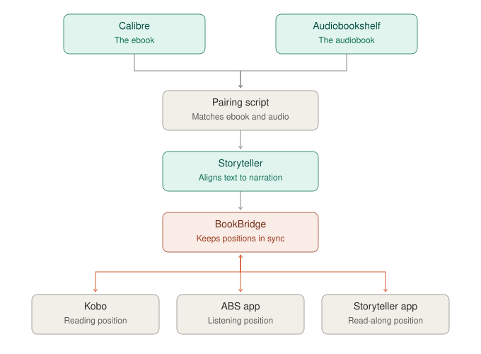

# Example setup: read-alongs that stay in sync

This is one home server's setup, shown as an example of what Omnarr sits on top of. These
pieces aren't part of Omnarr. Omnarr only reads the result: a book's ebook, audiobook and
read-along show up as one book with all three formats, plus your reading and listening
positions.

- **[Calibre](https://calibre-ebook.com/) / [Calibre-Web-Automated](https://github.com/crocodilestick/Calibre-Web-Automated)** hold the ebooks.
- **[Audiobookshelf](https://www.audiobookshelf.org/)** holds the audiobooks.
- **A small pairing script** finds books that exist as both an ebook and an audiobook, and
  hands each pair to Storyteller. It matches by author surname plus a 90% title-similarity
  threshold; Omnarr's own matcher uses the same rule.
- **[Storyteller](https://gitlab.com/storyteller-platform/storyteller)** aligns the text to
  the narration and produces a read-along EPUB.
- **[BookBridge](https://github.com/cporcellijr/bookbridge)** links the formats and keeps
  the reading and listening position in sync across a Kobo, the Audiobookshelf app and the
  Storyteller app.

Omnarr connects to all of them (see *Supported apps* in the [README](../README.md)) and
shows each book once, with every format and position.
